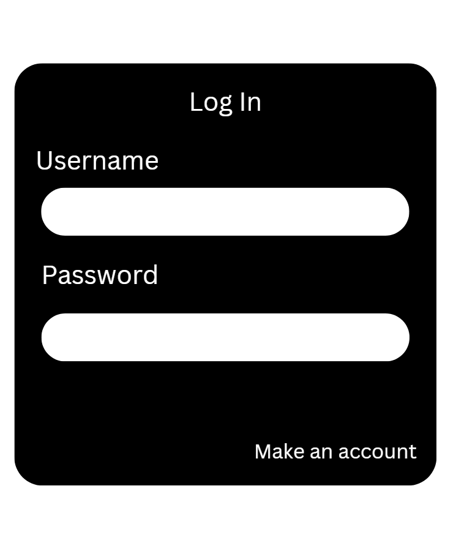
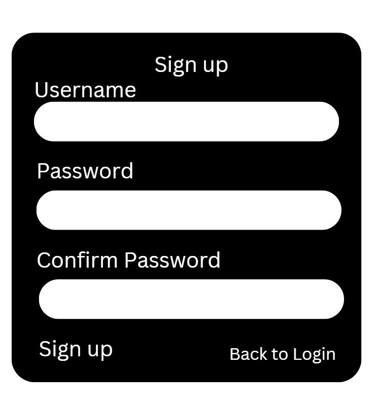
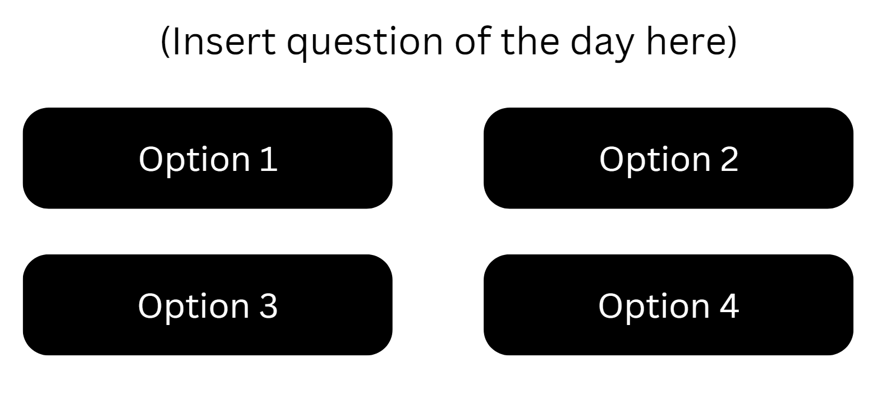
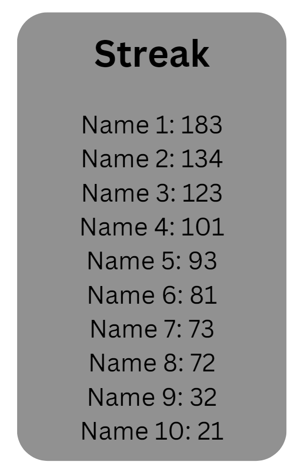
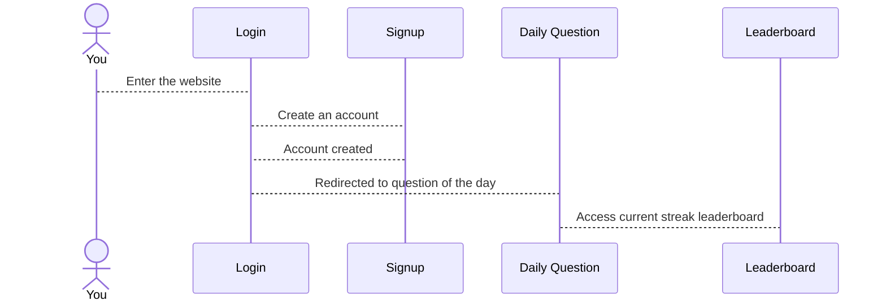

# Daily Quiz!

[My Notes](notes.md)

Dailyquiz.click is a website that has the user do daily questions and try to keep their streak going by doing the daily quizzes consistently and by not failing to answer the question correctly each day. The website will also include a leaderboard to see other users' high streaks.

## 🚀 Specification Deliverable

For this deliverable I did the following. I checked the box `[x]` and added a description for things I completed.

- [x] Proper use of Markdown
- [x] A concise and compelling elevator pitch
- [x] Description of key features
- [x] Description of how you will use each technology
- [x] One or more rough sketches of your application. Images must be embedded in this file using Markdown image references.

### Elevator pitch

This website is designed to challenge your general knowledge on any and all subjects by being asking a question about a random topic each day. The website is also a form of education that has the user either do their own research to answer the question, or find out new information by seeing which is the correct answer for the question of that specific day. By using a daily streak format. The website also motivates users to try and keep their streak alive while also competing with their friends, further motivating all users to continue educating themselves.

### Design
This is the login and Signup pages.

This is the page where the user will answer the question of the day.

This is where the user will be able to see other people's streaks.

Markdown:

### Key features

- The website being able to select random questions every day from third party
- Keeping track of the number of days you've gotten the question correct
- A leaderboard that keeps track of and organizes the top user's streaks

### Technologies

I am going to use the required technologies in the following ways.

- **HTML** - The HTML will be used to design the main structure and layout of the website.
- **CSS** - The CSS will be used to improve the visual appeal of the website's structure. It will also to ensure that the website is visually appealing regardless of the device used, such as a laptop or mobile phone.
- **React** - React will be used to find out what answer for the question the user selected is correct or not, while also handling whether their streak needs to increase or end.
- **Service** - The service will be used to handle the information used to login or create a new account as well as submitting the user's score and updating their streak.
- **DB/Login** - A database will be used to handle authenticating a user's login or creating a new user.
- **WebSocket** - TWebsocket will be used to provide the up-to-date leaderboard.

## 🚀 AWS deliverable

For this deliverable I did the following. I checked the box `[x]` and added a description for things I completed.

- [x] **Server deployed and accessible with custom domain name** - [My server link](https://dailyquiz.click).

## 🚀 HTML deliverable

For this deliverable I did the following. I checked the box `[x]` and added a description for things I completed.

- [x] **HTML pages** - I created 5 HTML pages for each part of this website. The login, signup, quiz, leaderboard, and about pages.
- [x] **Proper HTML element usage** - Proper use of head, body, nav, main, header, footer, and other general elements such as (a), (img), (li), (input), etc..
- [x] **Links** - Links were used to connect all the HTML files together. It was also used to link to both BYU's website and the CS260 Github in the about page.
- [x] **Text** - Text was used all throughout the pages to explain what each element is. It was also used to represent temporary objects and TBDs.
- [x] **3rd party API placeholder** - A temporary piece of text was used on the quiz page to represent where the questions and answers from 3rd parties will be placed and used.
- [x] **Images** - The only image currently used is a temporary logo in the about page. Images will be used more for backgrounds in the future.
- [x] **Login placeholder** - Both the signup and signin inputs have been included but temporarily don't do anything. Login and signup DB connections will come later.
- [x] **DB data placeholder** - All user streak length data and login info will be stored in a DB.
- [x] **WebSocket placeholder** - Placeholder data was placed in the leaderboard page. It will remain this way until the leaderboard is connected through websocket.

## 🚀 CSS deliverable

For this deliverable I did the following. I checked the box `[x]` and added a description for things I completed.

- [x] **Header, footer, and main content body** - I added CSS elements that allowed for all elements in the header, footer, and main body to change size depending on the height and width of the screen displaying it. Flex was also used to organize all 3 elements.
- [x] **Navigation elements** - I Used CSS to create a streamlined and visually pleasing navigation bar at the top of the website that's always present. It is also reactive, allowing the user to see which page they're on.
- [x] **Responsive to window resizing** - Every feature on the website was scaled using "vh" and "vw" when necessary, in order for it to display correctly on all devices. Flex was also used very often to ensure that the page is well organized and resizes well.
- [x] **Application elements** - The table meant to present the Websocket data has been updated using CSS to give it a much stronger visual appeal. The quiz page and its temporary question and answers also have CSS elements in preparation for the implementation of a 3rd party service.
- [x] **Application text content** - Fond size and color CSS elements were added onto all the text content within the website.
- [x] **Application images** - The website itself lacks images, however the Logo in the about page has some CSS elements applied to it, giving it a border, centering it, and allowing it to change size to present properly to all devices.

## 🚀 React part 1: Routing deliverable

For this deliverable I did the following. I checked the box `[x]` and added a description for things I completed.

- [x] **Bundled using Vite** - All files have been bundled using Vite, and all files needed were created.
- [x] **Components** - All components were moved over from their HTML files to the new JSX files.
- [x] **Router** - All pages have been routed to the Login Page. They've also been routed to eachother as necessary.

## 🚀 React part 2: Reactivity

For this deliverable I did the following. I checked the box `[x]` and added a description for things I completed.

- [x] **All functionality implemented or mocked out** - Functionality for the Login, Signup, Quiz, and Leaderboard has all been created and mocked out using ineternal storage
- [x] **Hooks** - useState and useEffect were both used in order to help with the implementation of the website's functionality

## 🚀 Service deliverable

For this deliverable I did the following. I checked the box `[x]` and added a description for things I completed.

- [x] **Node.js/Express HTTP service** - The backend was created using Node.js and express to be able to handle logings, sign ups, and streak/quiz tracking.
- [x] **Static middleware for frontend** - I added Express static middleware to serve frontend files from the `public/` directory.
- [x] **Calls to third party endpoints** - With the help of fetch(), i was able to call the third party endpoint of "Open Trivia Database" (https://opentdb.com) to have new questions for the website each day.
- [x] **Backend service endpoints** - Multiple API endpoints were created for this deliverable under "/api". Some examples are "/auth/create", "/quiz/question", and more
- [x] **Frontend calls service endpoints** - For the react frontend to interact with the backend for the services such as logging in, sign ups, quizzes, etc... "fetch()" was used.

## 🚀 DB/Login deliverable

For this deliverable I did the following. I checked the box `[x]` and added a description for things I completed.

- [x] **User registration** - I did not complete this part of the deliverable.
- [x] **User login and logout** - I did not complete this part of the deliverable.
- [x] **Stores data in MongoDB** - I did not complete this part of the deliverable.
- [x] **Stores credentials in MongoDB** - I did not complete this part of the deliverable.
- [x] **Restricts functionality based on authentication** - I did not complete this part of the deliverable.

## 🚀 WebSocket deliverable

For this deliverable I did the following. I checked the box `[x]` and added a description for things I completed.

- [ ] **Backend listens for WebSocket connection** - I did not complete this part of the deliverable.
- [ ] **Frontend makes WebSocket connection** - I did not complete this part of the deliverable.
- [ ] **Data sent over WebSocket connection** - I did not complete this part of the deliverable.
- [ ] **WebSocket data displayed** - I did not complete this part of the deliverable.
- [ ] **Application is fully functional** - I did not complete this part of the deliverable.
